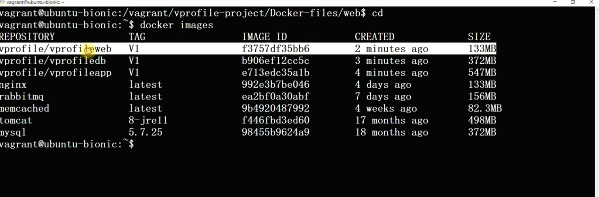
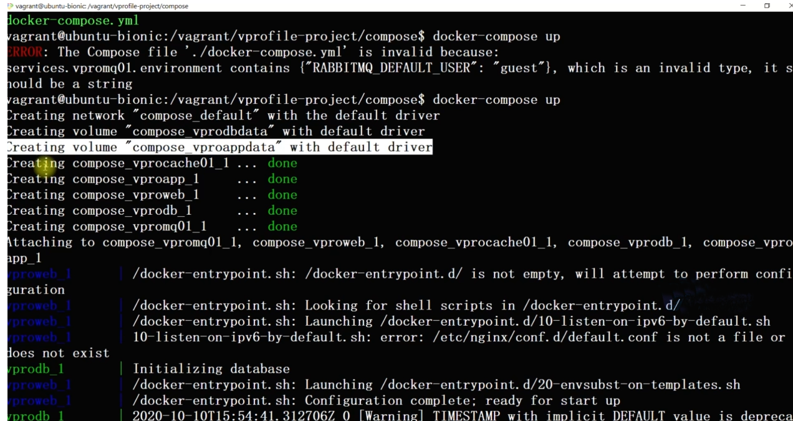
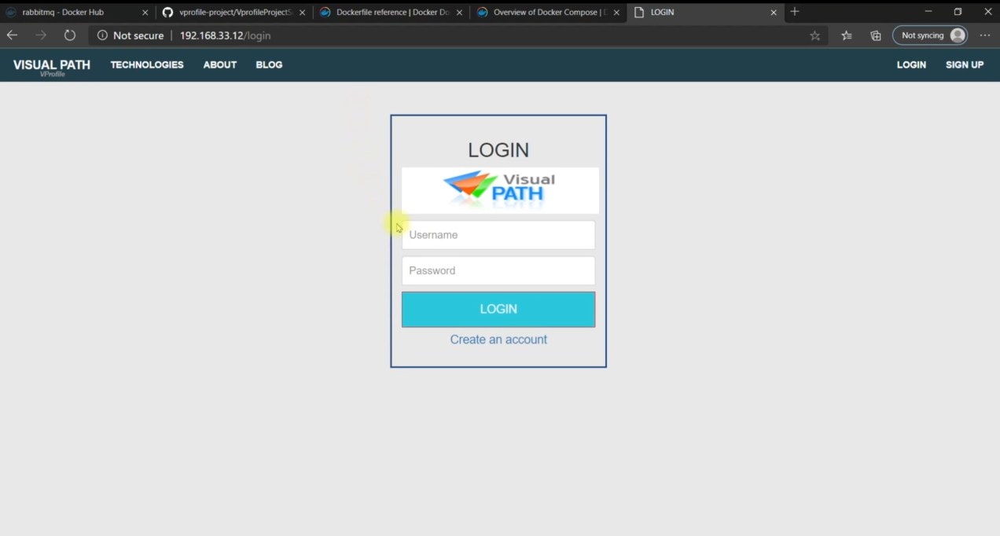
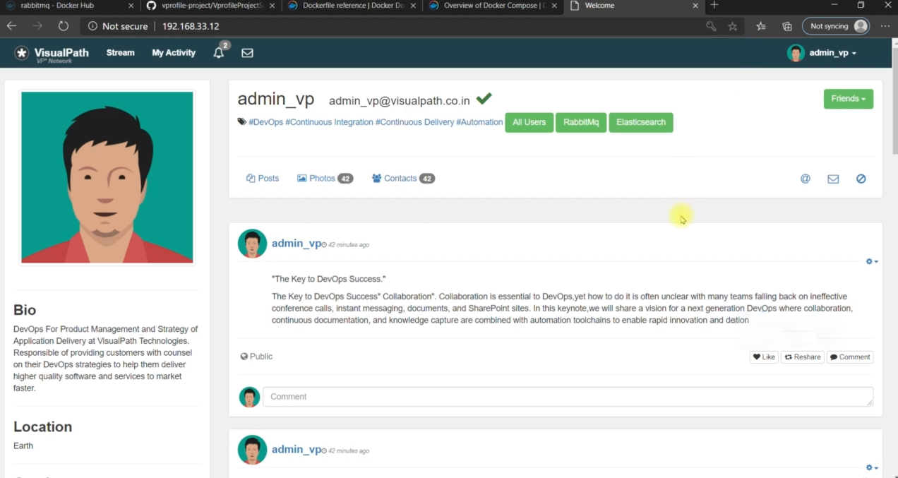
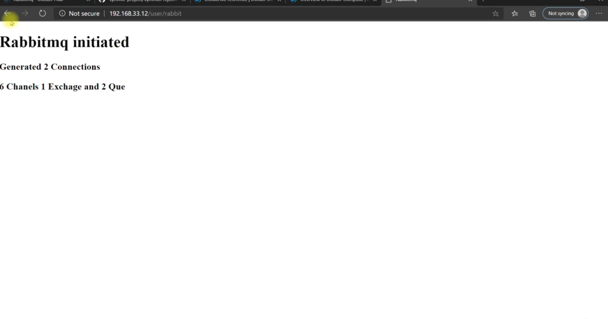
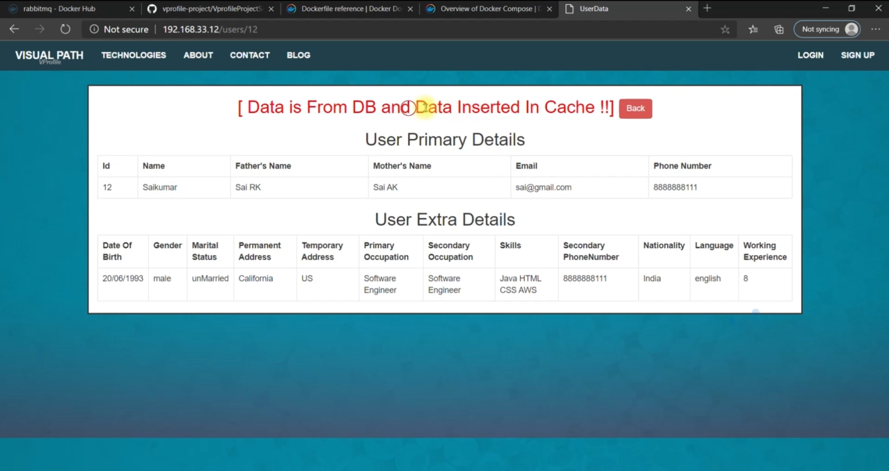

# ☕ Java Web App Containerization using Docker

This project demonstrates how to containerize a Java-based web application (WAR) using **Docker** and deploy it using a **Tomcat** container.

---

# Technologies Used

- Java (Maven project)
- Maven (build tool)
- Tomcat 8 (web server)
- Docker

---

## 📸 Screenshots

### ✅ Docker Images Running

### ✅ Docker Compose Services

### ✅ Java App Login Page

### ✅ App After Login

### ✅ RabbitMQ Dashboard

### ✅ Memcached Status

